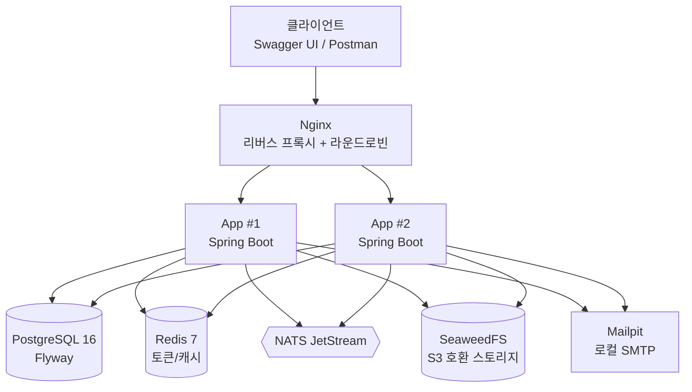

# DEV24 개발자 서적 쇼핑몰 — 현대화 리팩토링

원본 프로젝트(2020.10.19 ~ 2020.11.16, Spring 5 + MyBatis + JSP)를 최신 스택으로 현대화하는 프로젝트다.<br> 목표와 단계별 로드맵은 [`MODERNIZATION_PLAN.md`](./MODERNIZATION_PLAN.md)에 정리되어 있다.

## 개요

2020년에 만든 레거시 도서 쇼핑몰(Spring 5 + MyBatis + JSP, `legacy/DEV24Test`)을 Spring Boot 3 + JPA 기반으로 현대화한 프로젝트다. 전체 모듈을 얕게 포팅하는 대신 **인증 / 도서 카탈로그 / 장바구니·구매·재고 / 리뷰** 4개 핵심 모듈만 골라 깊게 개선했다(제외한 모듈과 이유는 [Out of Scope](#out-of-scope) 참고).

단순히 프레임워크만 갈아탄 게 아니라, 레거시가 안고 있던 실제 문제(평문 비밀번호 비교, 하드코딩된 DB 자격증명, 인덱스 없는 검색, 트랜잭션 경계 불일치 등 — [레거시 대비 개선점](#레거시-대비-개선점) 참고)를 근거를 남기며 고치는 데 집중했다.<br>
그래서 이 저장소 곳곳에는 "왜 이렇게 했는지"를 설명하는 `docs/*.md`와 `EXPLAIN ANALYZE`/응답시간 실측치(`docs/PERFORMANCE.md`)가 함께 있다.<br>
app 2 replica + Nginx 라운드로빈, Redis/NATS/SeaweedFS를 곁들인 `docker-compose.yml` 한 번으로 전체 인프라가 로컬에서 그대로 재현된다.

## 아키텍처



앱은 상태를 갖지 않는 REST API(JWT 인증)라 2개 replica 중 어느 인스턴스가 요청을 받아도 동일하게 동작하고, Nginx가 그 앞단에서 라운드로빈으로 분산한다. Postgres(영속 데이터)·Redis(토큰/캐시)·NATS JetStream(구매완료/재고부족 비동기 이벤트)·SeaweedFS(포토 리뷰 이미지)·Mailpit(로컬 메일 확인용)은 모두 `docker-compose.yml`에 컨테이너 하나씩으로 정의돼 있다.

### 이벤트 브로커: Kafka 대신 NATS JetStream를 택한 이유

구매 모듈의 비동기 이벤트(`OrderCompletedEvent`, `LowStockEvent`)는 Kafka 대신 **NATS JetStream**으로 구현한다.

- **가벼운 리소스 사용**: Kafka는 JVM 기반 브로커라 실행에 최소 수백 MB~1GB 이상의 메모리가 필요하지만, NATS(JetStream 포함)는 단일 Go 바이너리로 동작해 메모리 사용량이 훨씬 적다. 컨테이너별 메모리 상한(`mem_limit`)을 두는 이 프로젝트의 로컬 개발 환경 조건과도 잘 맞는다.
- **운영 단순성**: Zookeeper나 별도 컨트롤러 클러스터 없이 컨테이너 하나로 바로 실행 가능해 로컬 데모/CI 구성이 단순하다.
- **기능 충분성**: `OrderCompletedEvent`/`LowStockEvent`는 발행-구독 기반 최종적 일관성(eventual consistency) 처리가 목적이며, JetStream의 영속 스트림 + at-least-once 전달 보장만으로 충분하다. 대용량 스트리밍·파티셔닝 같은 Kafka 고유의 강점이 필요한 워크로드는 아니다.
- **트레이드오프**: Kafka가 업계 표준으로서 생태계·인지도 면에서는 더 유리하지만, 이 프로젝트 규모에서는 자원 효율성과 운영 단순성이 더 중요하다고 판단했다.

`OrderCompletedEvent` 발행(트랜잭션 커밋 후에만 발행되는 이유, 컨슈머 구독/ack 처리, 설정 방법)은 [`docs/NATS.md`](./docs/NATS.md) 참고.

### 재고 차감 동시성 제어: 낙관적 락(`@Version`)을 택한 이유와 한계

구매 모듈의 재고 차감은 비관적 락(`SELECT ... FOR UPDATE`) 대신 **낙관적 락(`@Version`)**으로 구현했다.

- 비관적 락은 트랜잭션이 끝날 때까지 재고 row를 계속 잠가, 인기 도서(hot row)에 주문이 몰리면 요청이 줄줄이 대기하며 처리량이 떨어진다.
- 온라인 서점의 재고 차감은 같은 도서를 노리는 두 요청이 정확히 같은 순간에 충돌하는 경우가 드물어, 대부분 잠금 없이 통과되고 드문 충돌 순간에만 재시도 비용을 지불하는 낙관적 락이 더 유리하다고 판단했다.
- **한계**: "선착순 한정판" 같은 초고경합(flash sale) 시나리오에서는 낙관적 락이 재시도 폭주로 비효율적일 수 있다. 그런 경우엔 비관적 락이나 Redis 기반 분산 큐잉/원자적 카운터가 더 나을 수 있다는 트레이드오프도 인지하고 있으며, 실제 도입 여부는 향후 개선 과제(`MODERNIZATION_PLAN.md` Phase 9)로 남겨뒀다.

## 기술 스택

- **Java 21(LTS) + Spring Boot 3.5.x** (Jakarta 네임스페이스 — virtual thread 등 최신 LTS 기능 언급 가능)
- **Gradle(Kotlin DSL)** — QueryDSL Q-type 코드젠 설정이 깔끔하고 최신 Spring 진영 관례에 가까움
- **PostgreSQL 16** + **Flyway** 스키마 버전관리 (`V5__add_book_search_index.sql`처럼 성능 개선 이력을 마이그레이션으로 남김)
- **Spring Security 6 + JWT** (Stateless REST API이므로 CSRF는 불필요)
- 공통 응답: `ApiResponse<T>` + `ErrorCode` enum + `@RestControllerAdvice`(`GlobalExceptionHandler`)
- **springdoc-openapi** (Swagger UI)
- 테스트: **JUnit5 + Mockito + AssertJ**(서비스 단위), **Testcontainers(Postgres)**(레포지토리/통합) — 라이브 Oracle 의존 테스트를 완전히 대체
- **GitHub Actions**로 push/PR 시 빌드+테스트 자동 실행
- **Redis 7** — 리프레시 토큰/로그아웃 블랙리스트(인증 모듈) + Spring Cache 캐싱(도서 카탈로그 모듈)
- **NATS JetStream** — 단일 바이너리로 가볍게 동작(Zookeeper/별도 컨트롤러 클러스터 불필요), 구매 완료 후 적립금/알림, 안전재고 이하 시 재입고 알림 등을 비동기 이벤트로 분리(구매 모듈), 테스트는 Testcontainers(NATS 이미지 기반 GenericContainer) 사용
- **Nginx** — 리버스 프록시 + app 2 replica 앞단 라운드로빈 로드밸런싱 데모
- **Dockerfile(멀티스테이지) + docker-compose.yml**(app×2 + postgres + redis + nats + nginx) — `docker-compose up` 한 번으로 전체 인프라 로컬 실행
- **컨테이너 메모리 제한** — `docker-compose.yml`에서 서비스별 `mem_limit`(또는 `deploy.resources.limits.memory`)로 최대 사용 메모리 상한 지정(예: DB(PostgreSQL) 512MB, Redis 256MB, NATS 128MB 등)
- **Claude Code (Anthropic)** — AI 코딩 어시스턴트를 활용해 개발

## ERD

To-Be 스키마는 [`docs/ERD.md`](./docs/ERD.md) 참고.

## 레거시 대비 개선점

| 영역 | Before (레거시) | After (리모델링) |
|---|---|---|
| DB 자격증명 | `root-context.xml`에 Oracle 계정/비밀번호가 평문으로 하드코딩되어 커밋됨 | 환경변수로 주입(`APP_JWT_SECRET` 등은 값이 없으면 기동 자체가 실패하도록 강제), 코드에 평문 비밀 없음 |
| 비밀번호 저장/인증 | `query/Login.xml`이 SQL `WHERE c_passwd = #{c_passwd}`로 평문 비교, insert/update도 해싱 없이 평문 저장 | `BCryptPasswordEncoder`로 해시 저장 + 애플리케이션 레벨 `matches()` 비교 |
| XSS | `freeboardDetail.jsp` 등이 `${detail.fb_content}`를 이스케이프 없이 EL로 직접 출력 — 저장형 XSS 가능 | OWASP HTML Sanitizer(`HtmlSanitizer.java`)로 저장 전 위험 태그/속성 제거 |
| 페이징 | `Book.xml`의 `bookList`가 도메인마다 3-depth rownum 서브쿼리 + 수동 인덱스 힌트를 개별 작성 | Spring Data `Pageable` 표준 페이징으로 통일 |
| 검색 성능 | 앞뒤 와일드카드 LIKE + 4컬럼 OR, 인덱스 없이 풀스캔 유발 | pg_trgm 트라이그램 인덱스 추가, 실측상 키워드 검색 최대 ~250배 개선(145.6ms → 0.58ms) |
| 캐시 | 없음(매 요청 DB 조회) | Redis 기반 Spring Cache — 상세조회 응답시간 최대 1.8배, 목록검색 최대 5.4배 개선 |
| 인증 방식 | 세션 기반(`JSESSIONID`), 서버가 상태를 가짐 | JWT Stateless — app 2 replica + Nginx 라운드로빈에서도 세션 동기화 불필요 |
| 트랜잭션 | 구매 흐름이 `/purchaseInsert`, `/pdetailInsert`, `/purchasedItemDelete` 등 별도 AJAX 엔드포인트로 쪼개져 일부만 `@Transactional` — 중간 실패 시 주문 헤더만 남거나 장바구니 미삭제 등 정합성 깨질 위험 | `PurchaseCommandService.purchase()` 전체를 단일 `@Transactional`로 묶고, `Stock.version` 낙관적 락으로 동시 주문 시 오버셀 방지 |
| 비동기 처리 | 없음(전부 동기 처리) | NATS JetStream으로 구매완료/재고부족 이벤트를 커밋 후 비동기 발행, at-least-once 재전달 보장 |

실측 근거는 [`docs/PERFORMANCE.md`](./docs/PERFORMANCE.md), 설계 이유는 [`docs/JWT.md`](./docs/JWT.md)/[`docs/NATS.md`](./docs/NATS.md)/[`docs/PURCHASE.md`](./docs/PURCHASE.md) 등 각 `docs/*.md` 참고.

- 4개 핵심 모듈 단위/통합 테스트 커버리지 감사 및 보완: [`docs/TESTING.md`](./docs/TESTING.md)
- JaCoCo 커버리지 측정 설정 및 리포트 읽는 법: [`docs/JACOCO.md`](./docs/JACOCO.md)

## 실행 방법

```bash
docker compose build
docker compose up -d
```

앱(2 replica) + Postgres(Flyway) + Redis + NATS JetStream + Nginx(리버스 프록시/로드밸런서)가 함께 뜬다. `http://localhost:8080/swagger-ui/index.html`에서 Swagger UI를 확인할 수 있다.

각 구성 요소를 왜 이렇게 만들었는지(멀티스테이지 Dockerfile, healthcheck, mem_limit, Nginx 라운드로빈, Flyway 베이스라인 등)와 단계별 명령어·트러블슈팅은 [`docs/DOCKER.md`](./docs/DOCKER.md) 참고.

### 데모 흐름

별도 프론트엔드 없이 Swagger UI와 Postman 컬렉션을 데모 경로로 사용한다.

- **Swagger UI**:<br>
  - `http://localhost:8080/swagger-ui/index.html`에서 Authorize 버튼에 로그인으로 발급받은 accessToken을 입력하면 인증이 필요한 API도 바로 호출 가능
- **Postman 컬렉션**:<br>
  - [`docs/postman/bookstore.postman_collection.json`](./docs/postman/bookstore.postman_collection.json)을 Postman에 import하면
  로그인 → 도서 목록/상세 → 장바구니 담기 → 구매 → 리뷰(텍스트/포토) 조회·작성 흐름을 폴더 순서(인증 → 도서 → 장바구니 → 구매 → 리뷰)대로 재현할 수 있다.<br>
  - 로그인 응답의 accessToken/refreshToken, 장바구니 담기 응답의 cartItemId는 컬렉션 변수에 자동 저장되어 뒤 요청에 그대로 전달된다. 단, 리뷰 작성에 필요한 `purchaseItemId`는 구매 API 응답에 포함되지 않으므로 DB에서 직접 확인해 `purchaseItemId` 변수에 입력해야 한다.<br>
  - 포토 리뷰는 1) presigned URL 발급 → 2) 발급받은 URL로 SeaweedFS에 이미지 직접 업로드 → 3) 리뷰 작성 3단계로 진행하며, 자세한 원리는 [`docs/REVIEW_IMAGE.md`](./docs/REVIEW_IMAGE.md) 참고.<br>
  - **2번 업로드 단계 주의**:
    - `POST /api/reviews/presigned-url`의 `fileName`은 문자열 메타데이터일 뿐 실제 파일이 아니다. 진짜 이미지 바이트는 그 응답으로 받은 `uploadUrl`에 **별도로** `PUT` 요청을 보내면서 실어야 한다.
    - Postman 컬렉션은 로컬 파일 경로를 export에 담지 않으므로(보안/이식성 때문에 의도된 동작) "포토 리뷰 2) 이미지 업로드" 요청을 열 때마다 Body 탭 > **binary**에서 실제 이미지 파일을 직접 선택한 뒤 Send해야 한다.
    - 이걸 빠뜨리면 빈(0바이트) 오브젝트가 업로드되어 비동기 검증(`ReviewImageValidationListener`)이 가짜 이미지로 판정, 리뷰가 자동으로 `TEXT`로 되돌아간다.

## Out of Scope

이번 리팩토링은 핵심 대표 모듈(인증, 도서 카탈로그, 장바구니/구매/재고, 리뷰) 4개만 깊게 개선한다.<br> 아래 모듈은 `legacy/DEV24Test`에 그대로 남아있고 신규 스택으로 포팅하지 않는다.

| 모듈 | 제외 이유 | 적용 가능한 패턴 |
|---|---|---|
| 자유게시판(freeboard/freecmt) | 시간 관계상 범위 제외 | 리뷰 모듈과 동일한 페이징/XSS 방지 패턴 적용 가능 |
| 공지사항/이벤트(ne/necmt) | 시간 관계상 범위 제외 | 리뷰 모듈과 동일한 페이징 패턴 적용 가능 |
| FAQ | 단순 CRUD, 소구점 낮음 | 도서 카탈로그 모듈과 동일한 조회/캐싱 패턴 적용 가능 |
| QnA | 시간 관계상 범위 제외 | 리뷰 모듈과 동일한 소유자 검증/페이징 패턴 적용 가능 |
| 마이페이지(주문/환불 내역) | 장바구니/구매 모듈과 중복되는 소구점 | 구매 모듈의 `PurchaseItem` 조회 패턴 재사용 가능 |
| 환불(refund) | 시간 관계상 범위 제외 | 구매 모듈과 동일한 트랜잭션 경계 설계 적용 가능 |

## 레거시 원본

`legacy/DEV24Test`에 원본 프로젝트를 그대로 보존했다(Before 근거).
