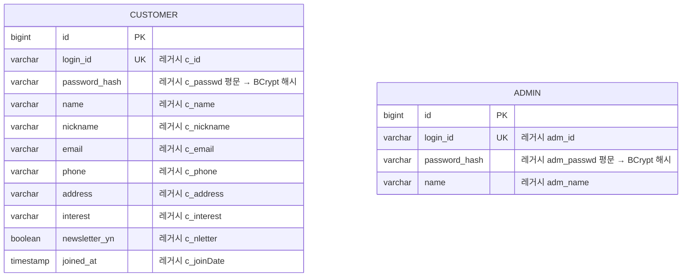
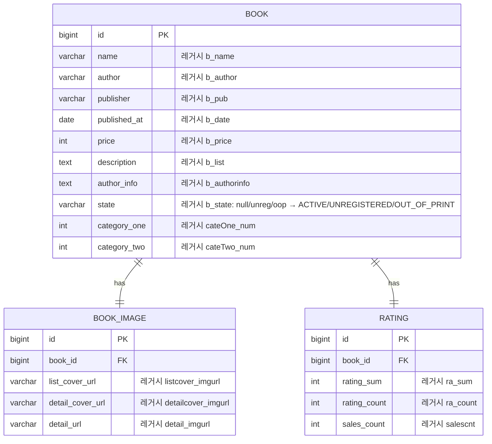
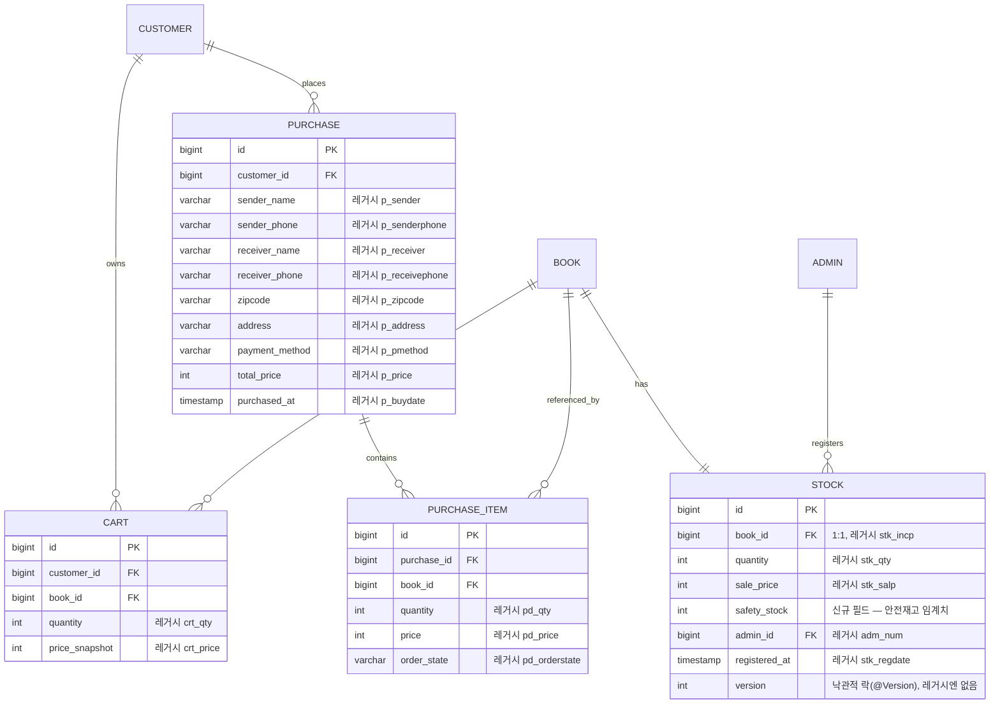
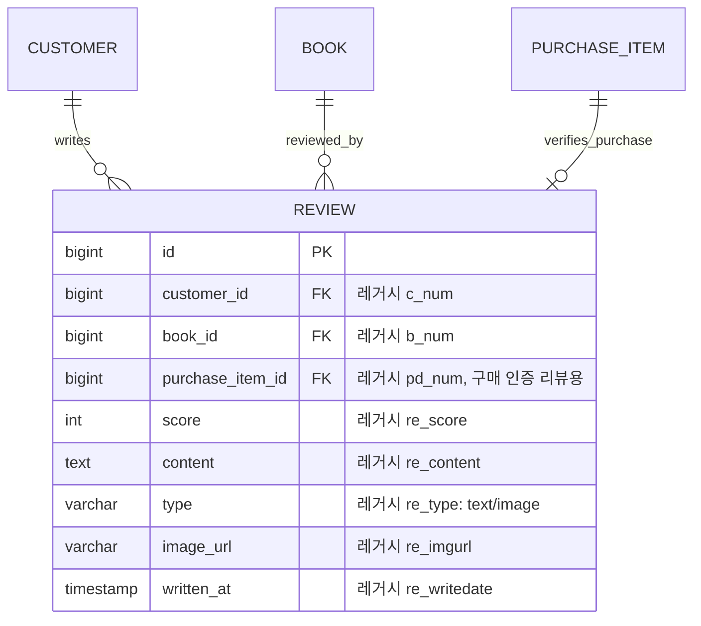

# ERD (To-Be, PostgreSQL)

> 패키지 루트는 `com.dev24.bookstore`로 확정. 아래 스키마는 레거시 Oracle 컬럼(`b_num`, `c_id` 등)을 그대로 복제하지 않고, `DEV24Test`의 VO/매퍼 필드를 근거로 정규화 + 영문 네이밍으로 재설계한 신규 JPA 엔티티 구조다. 실제 Gradle/Spring Boot 프로젝트 생성은 Phase 1에서 진행한다.

## 1. 인증 모듈

레거시 근거: `CustomerVO`(extends `LoginVO`), `AdminVO`.

Customer/Admin은 별도 테이블로 유지(레거시와 동일한 구분)하되, `Role`(CUSTOMER/ADMIN)을 Spring Security 인가에 사용. 리프레시 토큰/로그아웃 블랙리스트는 DB가 아닌 Redis에 저장(Phase 2).

## 2. 도서 카탈로그 모듈

레거시 근거: `BookVO`, `BookImgVO`, `Rating.xml`(namespace `RatingDAO`, `salescnt` 컬럼).

## 3. 장바구니 / 구매 / 재고 모듈

레거시 근거: `CartVO`, `PurchaseVO`, `PdetailVO`, `StockVO`/`StockDetailVO`, `stock.xml`(테이블 `stock`, `stk_incp`=book 참조, `stk_qty`, `stk_salp`, `adm_num`).

**신규 설계 포인트**
- `Stock.safety_stock`: 구매 가능 수량은 `quantity - safety_stock`로 검증(단순 재고 있음/없음이 아니라 임계치 기반 판매 가능 여부 판단). 임계치 이하로 떨어지면 `LowStockEvent`를 Kafka로 발행.
- `Stock.version`: 동시 구매 시 오버셀 방지용 낙관적 락. 비관적 락 대신 낙관적 락을 선택한 이유는 `MODERNIZATION_PLAN.md` 3절 참고.
- 구매 완료 트랜잭션 커밋 후 적립금/알림은 `OrderCompletedEvent`로 Kafka에 발행(비동기, 최종적 일관성으로 충분).

## 4. 리뷰 모듈

레거시 근거: `ReviewVO`(extends `CommonVO`, `pd_num` 참조로 실구매 검증 가능한 구조).

레거시는 `ReviewVO`에 `ra_num`/`ra_count`(평점 집계)를 함께 들고 있었으나, 신규 설계에서는 집계를 `RATING` 테이블(도서 카탈로그 모듈)로 일원화해 중복을 제거한다.
