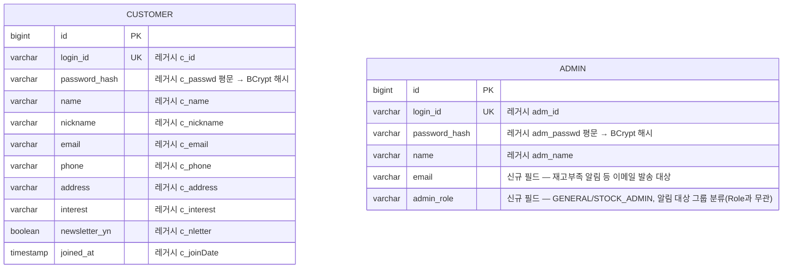
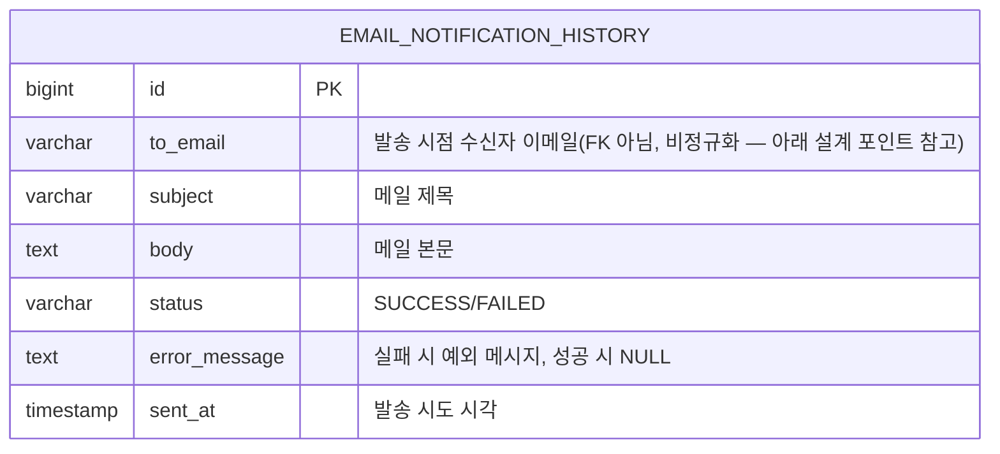

# ERD (To-Be, PostgreSQL)

> 패키지 루트는 `com.dev24.bookstore`로 확정.<br> 아래 스키마는 레거시 Oracle 컬럼(`b_num`, `c_id` 등)을 그대로 복제하지 않고, `DEV24Test`의 VO/매퍼 필드를 근거로 정규화 + 영문 네이밍으로 재설계한 신규 JPA 엔티티 구조다. 실제 Gradle/Spring Boot 프로젝트 생성은 Phase 1에서 진행한다.

## 1. 인증 모듈

레거시 근거: `CustomerVO`(extends `LoginVO`), `AdminVO`.



Customer/Admin은 별도 테이블로 유지(레거시와 동일한 구분)하되, `Role`(CUSTOMER/ADMIN)을 Spring Security 인가에 사용. 리프레시 토큰/로그아웃 블랙리스트는 DB가 아닌 Redis에 저장(Phase 2).

`Admin.admin_role`(`AdminRole` enum)은 `Role`과 이름은 비슷하지만 완전히 다른 개념이다 — `Role`은 인가(`@PreAuthorize`), `AdminRole`은 알림 대상 그룹 분류(재고 관리자 여부)일 뿐이다. 자세한 이유는 `docs/NATS.md` 참고.

## 2. 도서 카탈로그 모듈

레거시 근거: `BookVO`, `BookImgVO`, `Rating.xml`(namespace `RatingDAO`, `salescnt` 컬럼).

**데이터 소스**:<br>
관리자 도서 등록 기능은 구현 범위 밖이라, 카카오 도서 검색 API(`https://dapi.kakao.com/v3/search/book`, [공식 문서](https://developers.kakao.com/docs/ko/daum-search/dev-guide#search-book-info))로 우리 Postgres를 1회성·멱등성 있게 시딩한다
(라이브 프록시 아님 — 매 요청마다 외부 API를 타면 이 모듈의 핵심인 인덱스/`EXPLAIN ANALYZE`/캐시 히트-미스 비교 자체가 성립하지 않고, `Stock`/`Cart`/`PurchaseItem`/`Review`가 참조할 안정적인 `book_id`도 없어짐).<br>

아래 스키마는 카카오 API의 실제 `documents[]` 응답 필드(`title`/`contents`/`isbn`/`datetime`/`authors`/`publisher`/`price`/`sale_price`/`thumbnail`/`status`)에 맞춰 Phase 0 초안에서 일부 조정됐다:<br>
레거시의 `category_one`/`category_two`(1~8 숫자 코드, 카카오가 제공 안 함) 대신 검색 키워드를 저장하는 `category` 문자열 하나로 대체했고,
이미지도 레거시는 3개 URL(list/detail/detailcover)이었지만 카카오는 `thumbnail` 하나만 주므로 `image_url` 단일 필드로 축소했다.
`description`은 카카오 `contents`(책 소개 요약)로 채운다 — Phase 0 초안이 근거로 든 레거시 `b_list`(목차)보다 `b_info`(책 소개)에 의미상 더 가깝고, `b_list`(목차) 자체는 카탈로그 모듈 핵심과 무관해 필드에서 제외했다.
`author_info`(레거시 `b_authorinfo`, 저자 소개)는 카카오 API가 제공하지 않는 필드라 시딩된 도서는 항상 NULL이다.
`price`는 카카오 `price`(정가)를 쓴다 — 카카오는 `sale_price`(판매가)도 별도로 주지만, 우리 설계에서 실제 판매가는 재고 등록 시점에 정해지는 `Stock.sale_price`(3절, 장바구니/구매/재고 모듈)가 담당하므로 `Book`엔 정가만 둔다.
`isbn`은 카카오가 제공하는 안정적인 자연키라 신규 추가 — 시딩 재실행 시 중복 삽입 방지(호출 횟수 절약)에도 쓰인다. 카카오 `isbn` 필드엔 ISBN-10/ISBN-13이 공백으로 함께 오거나 하나만 오므로, 임포터가 13자리 쪽을 우선 선택해 저장한다(`isbn` 컬럼은 `VARCHAR(20)` 하나만 유지).
`state`는 카카오 `status`(정상판매/품절/절판 등)를 `ACTIVE`/`SOLD_OUT`/`OUT_OF_PRINT`로 매핑한다 — `UNREGISTERED`는 관리자 등록 절차가 없는 이번 시딩 파이프라인에서는 나올 일이 없지만, 향후 관리자 등록 기능이 추가될 경우를 대비해 enum엔 남겨둔다.

```mermaid
erDiagram
    BOOK ||--|| BOOK_IMAGE : has (1:1 관계)
    BOOK ||--|| RATING : has (1:1 관계)
    BOOK {
        bigint id PK
        varchar isbn UK "국제 표준 도서번호(ISBN10/13 공백 혼재, 13자리 우선), 시딩 중복방지용"
        varchar title "도서 제목"
        varchar authors "도서 저자 리스트 authors[] 배열을 콤마로 join"
        varchar publisher "도서 출판사"
        date published_at "도서 출판날짜 datetime(ISO 8601)에서 날짜만 추출"
        int price "도서 정가 price(정가) — sale_price(판매가)는 Stock.sale_price가 별도 관리"
        text contents "책 소개 요약"
        text author_info "카카오 API 미제공 — 시딩된 도서는 항상 NULL, 레거시 b_authorinfo"
        varchar category "카카오 미제공 — 레거시 cateOne_num/cateTwo_num 대체, 시딩 검색 키워드 저장"
        varchar status "카카오 status(정상판매/품절/절판) → ACTIVE/SOLD_OUT/OUT_OF_PRINT"
    }
    BOOK_IMAGE {
        bigint id PK
        bigint book_id FK
        varchar image_url "도서 표지 미리보기 URL(thumbnail)"
    }
    RATING {
        bigint id PK
        bigint book_id FK
        int rating_sum "레거시 ra_sum"
        int rating_count "레거시 ra_count"
        int sales_count "레거시 salescnt (구매 시 +pd_qty로 증가 — 레거시의 +1 버그 재현 금지)"
    }
```

## 3. 장바구니 / 구매 / 재고 모듈

레거시 근거: `CartVO`, `PurchaseVO`, `PdetailVO`, `StockVO`/`StockDetailVO`, `stock.xml`(테이블 `stock`, `stk_incp`=book 참조, `stk_qty`, `stk_salp`, `adm_num`).

```mermaid
erDiagram
    CUSTOMER ||--o{ CART : owns (1:N 관계)
    BOOK ||--o{ CART : referenced_by (1:N 관계)
    CUSTOMER ||--o{ PURCHASE : places (1:N 관계)
    PURCHASE ||--o{ PURCHASE_ITEM : contains (1:N 관계)
    BOOK ||--o{ PURCHASE_ITEM : referenced_by (1:N 관계)
    BOOK ||--|| STOCK : has (1:1 관계)
    ADMIN ||--o{ STOCK : registers (1:N 관계)

    CART {
        bigint id PK
        bigint customer_id FK
        bigint book_id FK
        int quantity "레거시 crt_qty"
        int price_snapshot "레거시 crt_price"
    }
    PURCHASE {
        bigint id PK
        bigint customer_id FK
        varchar sender_name "레거시 p_sender"
        varchar sender_phone "레거시 p_senderphone"
        varchar receiver_name "레거시 p_receiver"
        varchar receiver_phone "레거시 p_receivephone"
        varchar zipcode "레거시 p_zipcode"
        varchar address "레거시 p_address"
        varchar payment_method "레거시 p_pmethod"
        int total_price "레거시 p_price"
        timestamp purchased_at "레거시 p_buydate"
    }
    PURCHASE_ITEM {
        bigint id PK
        bigint purchase_id FK
        bigint book_id FK
        int quantity "레거시 pd_qty"
        int price "레거시 pd_price"
        varchar order_state "레거시 pd_orderstate"
    }
    STOCK {
        bigint id PK
        bigint book_id FK "1:1, 레거시 stk_incp"
        int quantity "레거시 stk_qty"
        int sale_price "레거시 stk_salp"
        int safety_stock "신규 필드 — 안전재고 임계치"
        bigint admin_id FK "레거시 adm_num"
        timestamp registered_at "레거시 stk_regdate"
        int version "낙관적 락(@Version), 레거시엔 없음"
    }
```

**신규 설계 포인트**
- `Stock.safety_stock`: 구매 가능 수량은 `quantity - safety_stock`로 검증(단순 재고 있음/없음이 아니라 임계치 기반 판매 가능 여부 판단). 임계치 이하로 떨어지면 `LowStockEvent`를 NATS JetStream으로 발행.
- `Stock.version`: 동시 구매 시 oversell 방지용 낙관적 락. 비관적 락 대신 낙관적 락을 선택한 이유는 `MODERNIZATION_PLAN.md` 3절 참고.
- 구매 완료 트랜잭션 커밋 후 적립금/알림은 `OrderCompletedEvent`로 NATS JetStream에 발행(비동기, 최종적 일관성으로 충분).
- 관리자 도서/재고 등록 UI가 없는 범위(2절 참고)라, 도서 카탈로그 시딩(`BookSeedService`)이 책마다 `Stock`도 함께 만든다 — 수량/안전재고는 시딩 전용 기본값, `sale_price`는 카카오 `sale_price`(없으면 `price`로 대체)를 그대로 쓴다. `Stock.admin_id`엔 실제 관리자가 없으므로 시딩 전용 시스템 관리자(`book-seed-admin`, 로그인 목적 없음)를 등록자로 기록한다.

## 4. 리뷰 모듈

레거시 근거: `ReviewVO`(extends `CommonVO`, `pd_num` 참조로 실구매 검증 가능한 구조).

```mermaid
erDiagram
    CUSTOMER ||--o{ REVIEW : writes (1:N 관계)
    BOOK ||--o{ REVIEW : reviewed_by (1:N 관계)
    PURCHASE_ITEM ||--o| REVIEW : verifies_purchase (1:0~1 관계)

    REVIEW {
        bigint id PK
        bigint customer_id FK "레거시 c_num"
        bigint book_id FK "레거시 b_num"
        bigint purchase_item_id FK,UK "레거시 pd_num, 구매 인증 리뷰용 - 구매 아이템 1개당 리뷰 최대 1개"
        int score "레거시 re_score"
        text content "레거시 re_content"
        varchar type "레거시 re_type: text/image"
        varchar image_url "레거시 re_imgurl"
        timestamp written_at "레거시 re_writedate"
    }
```

레거시는 `ReviewVO`에 `ra_num`/`ra_count`(평점 집계)를 함께 들고 있었으나, 신규 설계에서는 집계를 `RATING` 테이블(도서 카탈로그 모듈)로 일원화해 중복을 제거한다.

## 5. 알림 모듈

레거시 근거: 없음(신규 기능 — 레거시엔 이메일 발송/이력 개념 자체가 없음).



**신규 설계 포인트**
- `EMAIL_NOTIFICATION_HISTORY`는 특정 모듈 소속이 아니라 `EmailNotificationSender`(`common/notification`)를 거치는 모든 발송을 기록하는 공용 이력이다.<br>
`OrderCompletedEvent`(구매완료 → `Customer`) / `LowStockEvent`(재고부족 → `Admin`) 둘 다 이 창구를 공유하므로, `CUSTOMER`/`ADMIN` 어느 한쪽으로도 FK를 걸 수 없다 — `to_email`에 발송 시점의 이메일 주소를 그대로 남겨 수신자가 이후 이메일을 바꿔도 이력이 왜곡되지 않게 한다.
- `EmailNotificationSender`는 발송 실패를 호출부에 전파하지 않고 로그만 남기는 설계(NATS 재전달 시 적립금 중복 지급을 막기 위함, 3절 참고)라, `status`/`error_message`가 성공/실패를 확인할 수 있는 유일한 창구가 된다.
- 수신자 이메일이 없어(`to`가 null/blank) 발송 자체를 시도하지 않은 경우는 이력을 남기지 않는다 — "발송 시도"가 없었기 때문이다.
